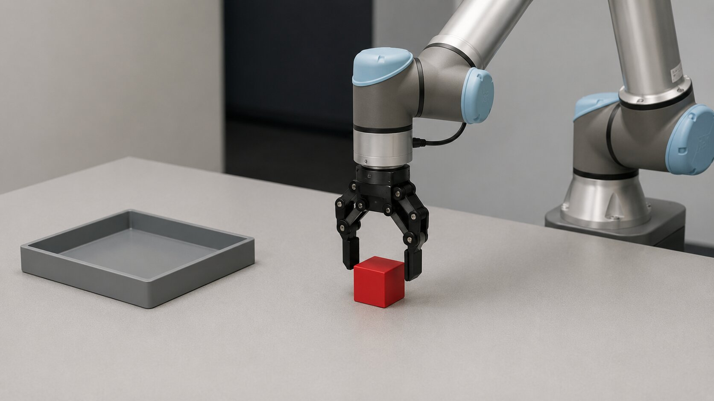
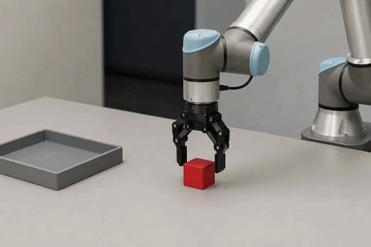
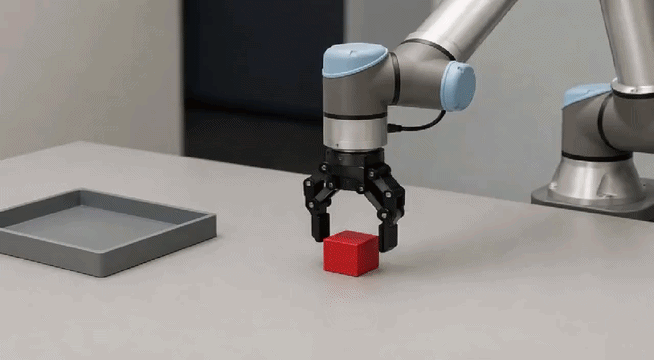
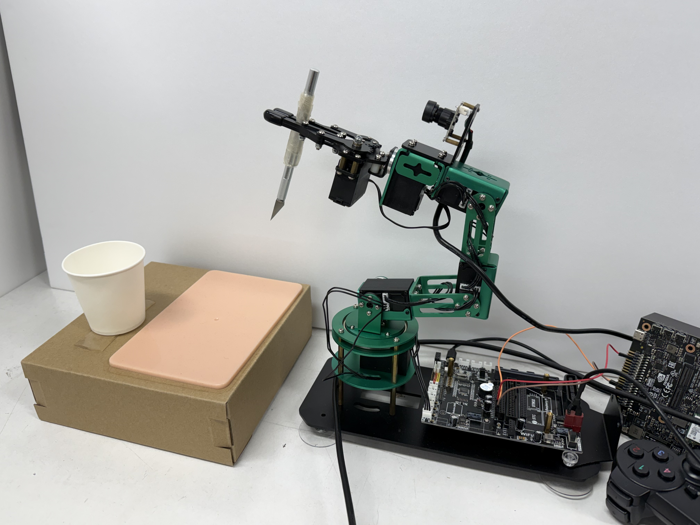
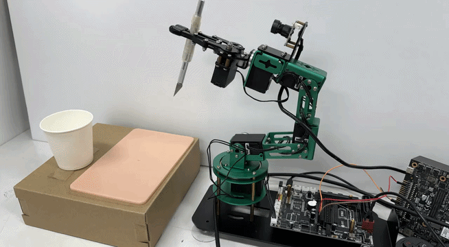
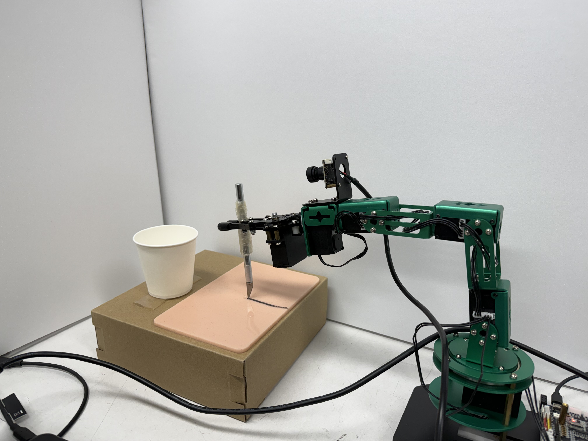
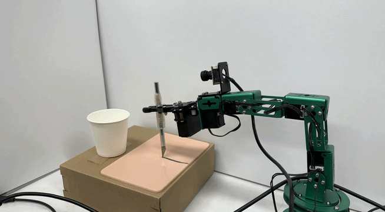

# Sample Outputs

Input images and the videos generated from them, shown so the single-image → motion mapping is visible at a glance.

GIFs here are downscaled previews of the original `.mp4` outputs. Full clips are not committed to this repository. All input images are in [`results/inputs/`](inputs/).

Shared recipe unless noted: `720x480`, `steps=50`, `frames=49`, `guidance_scale=6.0`, `bf16`, fixed `negative_prompt`, `seed=42`. Script: [`scripts/run_i2v_showcase.py`](../scripts/run_i2v_showcase.py).

---

## 1. Model comparison — robot arm + cube (grasp/lift)

Same input, same settings, two models. This is the multi-object, purposeful-manipulation case — the hard one for base models.

Input: AI-generated image of a robot arm with a parallel-jaw gripper positioned above a red cube.

  

<b>Input image used for both models</b>

<table>
  <tr>
    <th width="50%">CogVideoX-5B-I2V</th>
    <th width="50%">Cosmos-Predict2.5-2B</th>
  </tr>
  <tr>
    <td align="center">
      
    </td>
    <td align="center">
      
    </td>
  </tr>
</table>

**Observation.** Both models struggle with the grasp→lift case: the gripper–cube bond does not hold once the arm lifts. CogVideoX is noticeably less natural; Cosmos-Predict2.5 is better but still imperfect. Individual frames look plausible — the physical cause-and-effect of lifting does not. This is the concrete evidence behind choosing Cosmos-Predict2.5 as the main candidate, and why domain fine-tuning is the next step rather than more prompt tuning.

---

## 2. Real-photo input — robot tool-use on a surface (Cosmos-Predict2.5-2B)

Input: actual photos from the project setup — a DOFBOT arm holding a tool, photographed at two action stages. Both generated with Cosmos-Predict2.5-2B.

### Stage 1 — Approach: tool above the surface

<table>
  <tr>
    <th width="50%">Input</th>
    <th width="50%">Generated video</th>
  </tr>
  <tr>
    <td align="center">
      
    </td>
    <td align="center">
      
    </td>
  </tr>
</table>

### Stage 2 — Contact + linear motion: tool drawn across the surface

<table>
  <tr>
    <th width="50%">Input</th>
    <th width="50%">Generated video</th>
  </tr>
  <tr>
    <td align="center">
      
    </td>
    <td align="center">
      
    </td>
  </tr>
</table>

**Observation.** Both stages generated naturally — the approach and straight-line sliding contact are predicted smoothly. Compared to the grasp/lift failure above, the pattern is clear: the base model handles approach and sliding-contact motion well, but breaks on grasping, lifting, and releasing objects. The failure is specific to that kind of physical interaction, not to motion generation in general — which tells me exactly what fine-tuning needs to target.

---

## Runtime / memory

| Model                | Clip length       | Steps | Runtime                  | Peak VRAM |
| -------------------- | ----------------- | ----- | ------------------------ | --------- |
| CogVideoX-5B-I2V     | 49 frames / ~6 s  | 50    | ~6 min                   | ~34.6 GB  |
| Cosmos-Predict2.5-2B | ~93 frames / ~6 s | 50    | ~25 min with CPU offload | ~32.5 GB  |

Both fit on the 48 GB RTX A6000 at inference. Fine-tuning memory is a separate question — see [`finetuning_plan.md`](../finetuning_plan.md).

> An earlier CogVideoX single-image test measured ~21.2 GB peak under the same resolution/frame settings. The gap from ~34.6 GB is most likely about when peak memory was sampled, not a settings change.
